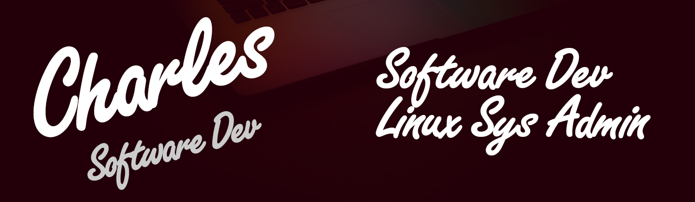

# Hello, World! 

Hi, am Charles, a Full Stack Software Dev and Linux Systems Administrator from Nairobi, Kenya, currently working/serving in the Kenya Army.

I specialize in
>
>- [X] **JavaScript - React** - Frontend Development
>
>- [X] **Python - Django** - Backend Development
>
>- [X] **Python - Bash** - Scripting & Automation

## Tools & Tech

<!-- 
 -->

## Hobbies
When am not coding, am reading (sci-fi and fantasy novels), watching a good (read, Mr. Robot) show.

I'm also actively learning about Cyber Security and hacking things on [tryhackme](https://tryhackme.com/). 

Check out my  profile.
